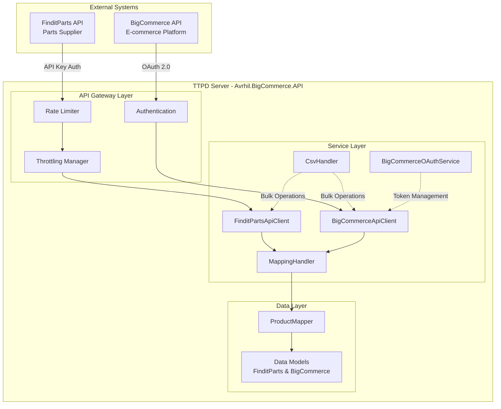
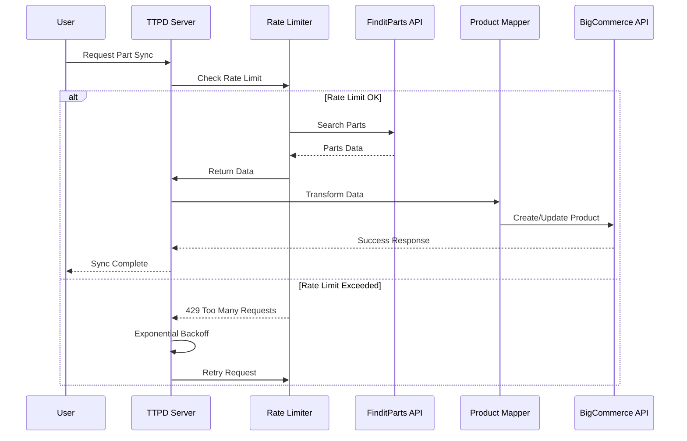
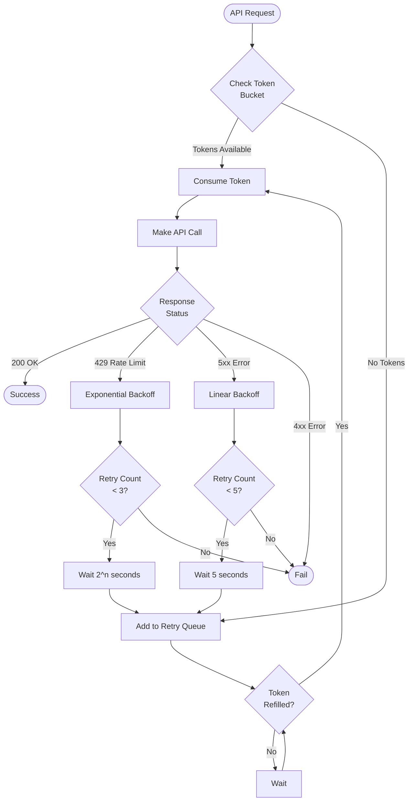
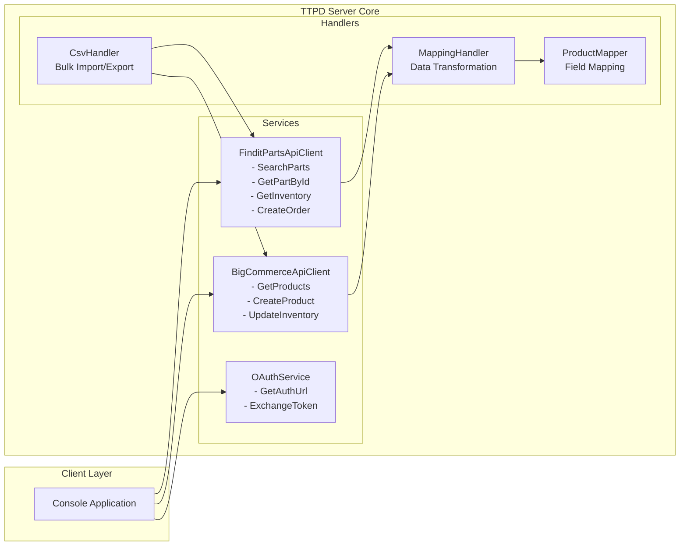
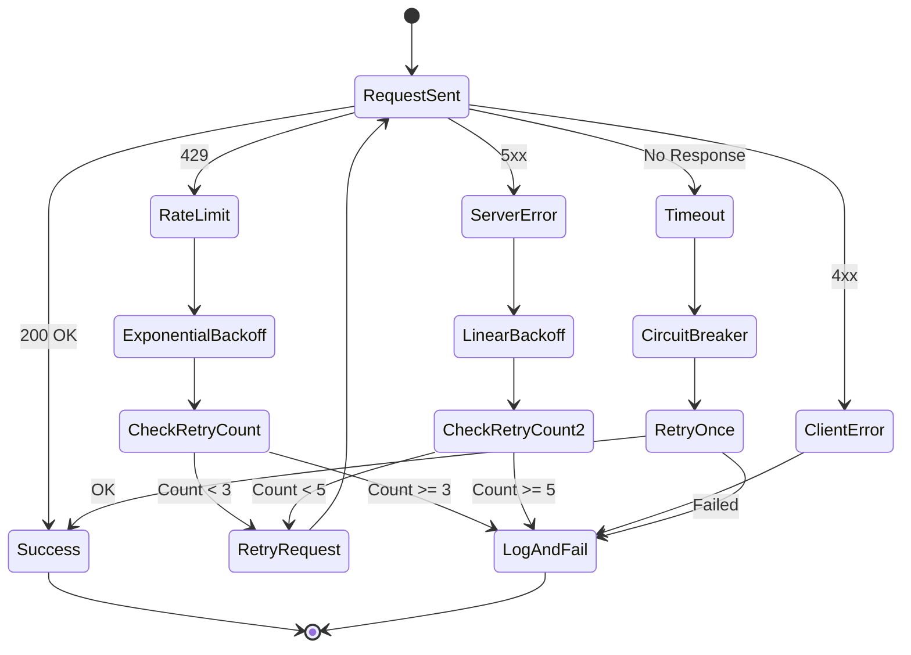
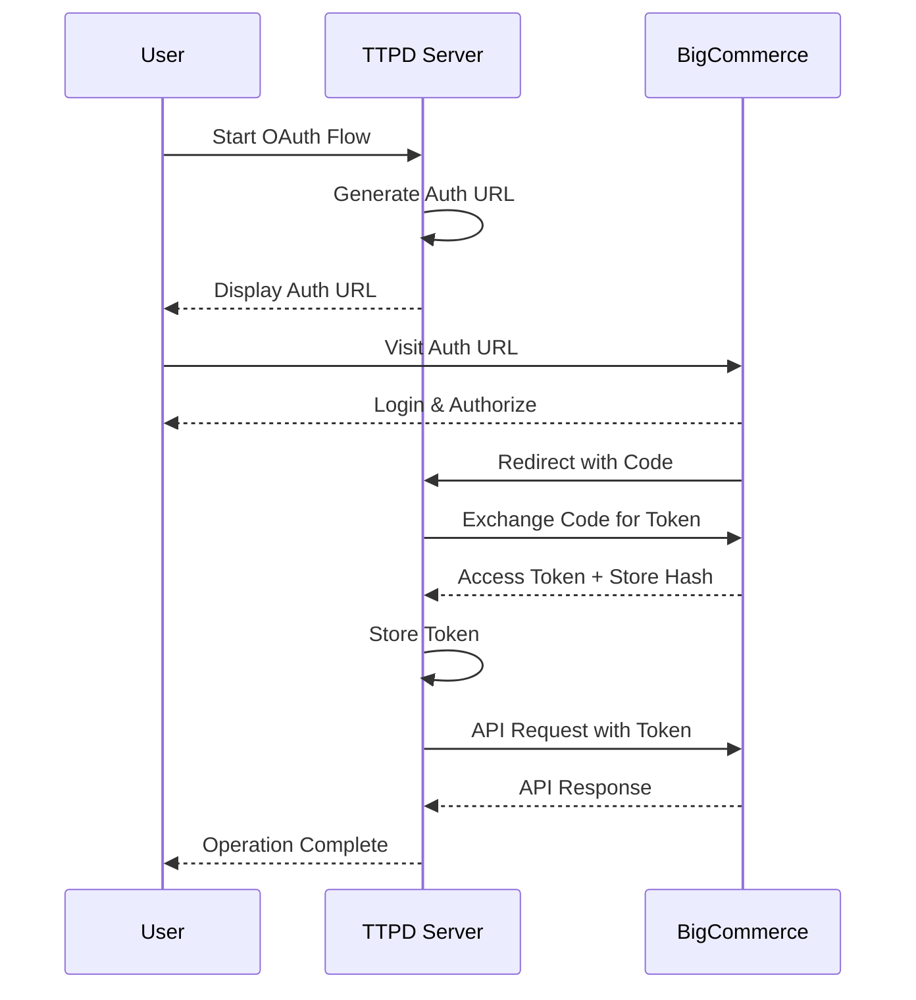
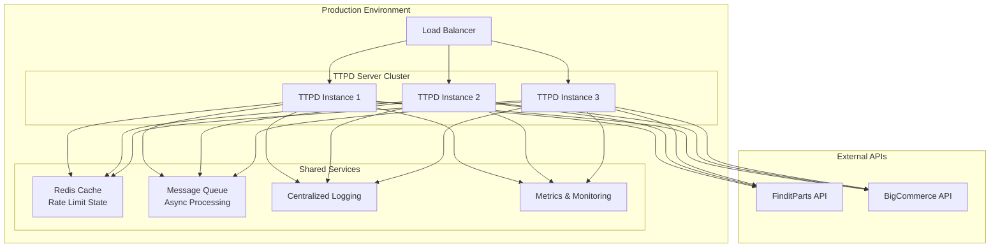
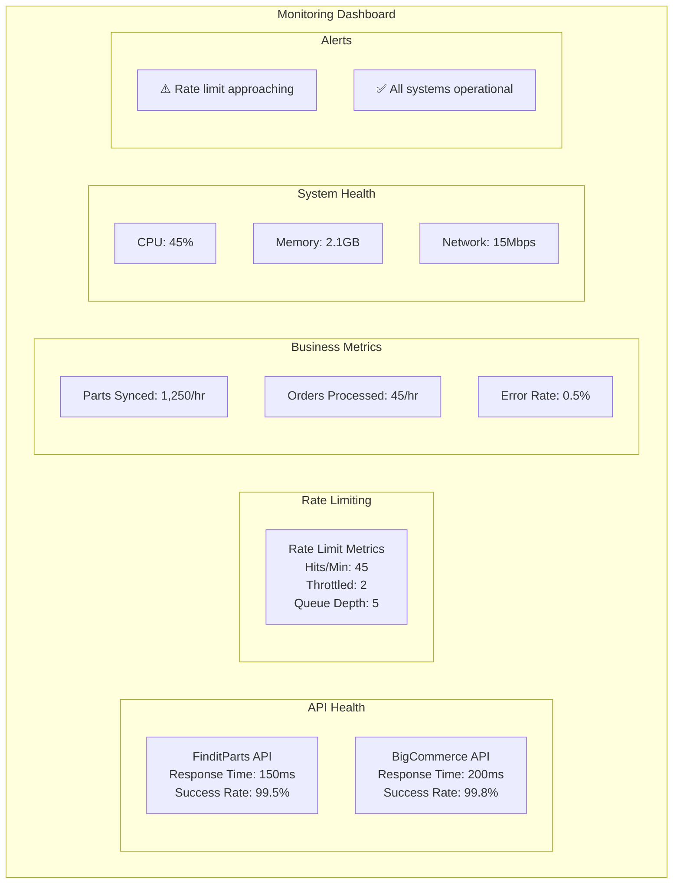
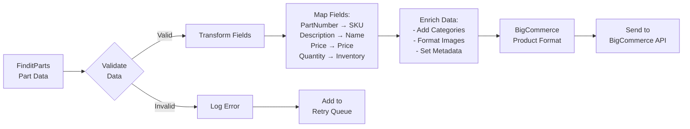
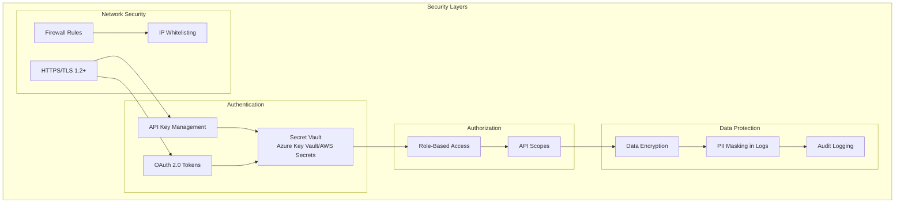

# TTPD Server Architecture - Visual Diagrams

## 1. High-Level System Architecture

## 2. Data Flow Architecture

## 3. Rate Limiting Flow

## 4. Component Interaction Diagram

## 5. Error Handling Flow

## 6. OAuth Authentication Flow

## 7. Deployment Architecture

## 8. Monitoring Dashboard Layout

## 9. Data Transformation Pipeline

## 10. Security Architecture

---

## Diagram Legend

- **Solid Lines**: Synchronous communication
- **Dashed Lines**: Asynchronous communication
- **Rectangles**: Services/Components
- **Diamonds**: Decision points
- **Circles**: Start/End points
- **Subgraphs**: Logical groupings

---

## How to View These Diagrams

These diagrams use Mermaid syntax and can be viewed in:
1. **GitHub/GitLab**: Automatically rendered
2. **VS Code**: Install "Markdown Preview Mermaid Support" extension
3. **Online**: https://mermaid.live/
4. **Documentation Tools**: Confluence, Notion, etc.
